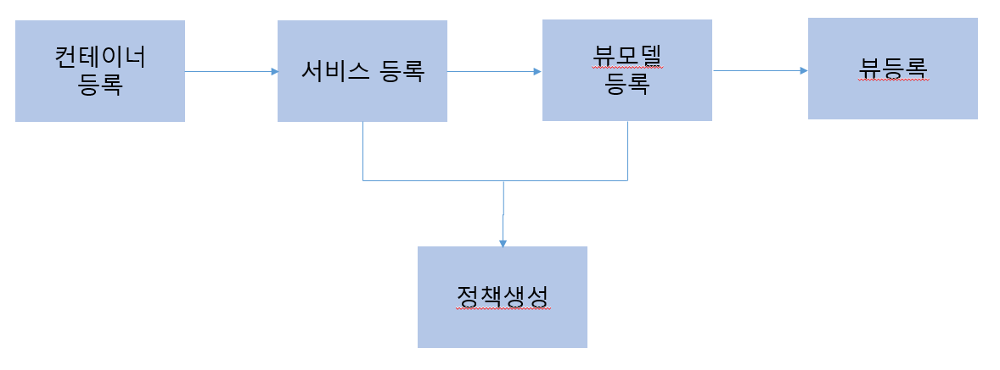

# TIL
## MVVM(모델-뷰-뷰모델) 패턴
- PM 패턴을 특화시킨 패턴
- MVVM 패턴의 구성:
    - 모델:
    업무 개념을 나타내는 엔티티(Entity)
    - 뷰:
    모델의 데이터를 화면상에 나타내기 위한 그래픽 컨트롤들의 집합
    WPF의 윈도우나 실버라이트 페이지가 될 수 있음
    단순히 XAML 데이터템플릿 컨트롤이 될 수도 있음
    - 뷰모델:
    모든 것을 가능하게 함
    UI 로직, 커맨드, 이벤트, 모델에 대한 참조가 포함됨
    MVVM에서는 뷰모델이 UI에 표시되는 데이터의 갱신을 직접 관리하지는 않음 
    왜?
    WPF와 실버라이트에서 제공되는 강력한 데이터바인딩(data-binding) 엔진 때문임.
    뷰: 뷰모델의 관찰자
    뷰모델의 변경사항이 일어날 때마다 UI는 스스로를 갱신하게 됨
    -> 이것을 위해 뷰모델이 INotifyPropertyChanged 인터페이스를 상속받고 PropertyChanged 이벤트를 발생시켜야 함

## MVVM UI 레이어
### MVVM 패턴의 소개
- 뷰: 데이터바인딩 엔진과 컨트롤의 집합을 포함하는 XAML 유저 컨트롤(UserControl)/페이지(Page)/윈도우(Window)라고 할 수 있음
- 모델: 뷰모델에서 파생된 하나 혹은 그 이상의 도메인 엔티티
- 뷰모델: 뷰가 UI를 캡슐화하는 동안 때로 명확하지 않은 UI의 프리젠테이션 로직을 캡슐화함

- 뷰모델을 뷰에 바인딩할 때 UI에서 사용 가능한 뷰모델의 속성들과 이벤트들을 만듬, 사용자 인터페이스 제공 가능함
- 뷰와 뷰모델 사이의 상호작용은 데이터 바인딩, 커맨드 등을 통해 발생함

- 뷰의 데이터템플릿의 속성들을 정확하게 바인딩하기 위해 어떻게 커스터마이징 해야 하는지 알아야 함
- 데이터템플릿은 비하인드 코드를 포함하지 않는 UI 정의를 위한 명확한 방법
    - 뷰모델을 자동적으로 바인딩하는 기본적인 방법임

### 뷰
- 사용자와 함께 상호작용하고 사용자들에게 데이터를 표시하는 역할을 가진 시각적인 인터페이스
- 뷰는 유저컨트롤이나 윈도우 혹은 페이지가 됨
- 호환되는 MVVM 뷰를 만들기 위해서는 뷰의 데이터 컨텍스트에 뷰모델의 참조를 추가해야 함
-> 뷰에 노출된 컨트롤들에 해당하는 뷰모델의 커맨드와 속성들을 바인딩 가능함
-> 절차적 접근을 사용하여 데이터 컨텍스트에 참조를 추가하기만 하면 됨
```C#
public void SetViewModel(PersonModel dataSource)
{
    this.DataContext = dataSource;
}
```
[다른 방법]
```XAML
<Window x:Class="MVVM.MainWindow"
        xmlns:vm = "clr-namespace:MVVM"
        Title = "MainWindow" Height="250" Width="250">
    <Window.DataContext>
        <vm:PersonViewModel/>
    </Window.DataContext>
</Window>
```
- 이 단계를 완료한 후, UI 디자이너는 뷰 컨트롤에 뷰모델 속성의 바인딩을 할당하거나 레이아웃 생성 등의 남아있는 작업을 처리 가능함

### 모델
- 모델: 데이터 레이어와 비즈니스 레이어와 같은 데이터 저장소로부터 데이터를 전달하는 역할을 하는 엔티티
- 뷰모델: 특정 UI 에서 필요로 하는 유효성검사나 비헤이비어를 포함하는 뷰를 노출하기 위한 모델

[MVVM을 구현할 때 하는 일반적인 실수]
- 뷰모델에서 뷰로 모델을 전달하는 것<br>
`<TextBox Grid.Column="2" Grid.Row="1" Text="{Binding PersonModel.FirstName}" />`
- 뷰가 모델에서 직접 속성을 바인딩하는 것 -> 비추
- 뷰모델이 해당 속성을 노출하고 Person 모델의 FirstName이라는 속성으로 노출될 수 있게 분리해야 함<br>
`<TextBox Grid.Column="2" Grid.Row="1" Text="{Binding FirstName}"/>`
- 전체 모델을 직접적으로 뷰에 노출하지 않게 함 -> 어플리케이션의 안정성 개선!

### WPF와 실버라이트에서의 커맨드
- WPF와 실버라이트의 가장 흥미로운 기능 중 한 가지: ICommand 인터페이스, 이 인터페이스의 동작 방식
- ICommand 인터페이스: 커맨드의 실행을 제어하는 Execute와 CanEXecute 메서드를 제공함
- WPF와 실버라이트에서 바인딩 엔진과 ICommand 구현을 사용하면 뷰에서 ICommand 커맨드가 제공하는 뷰모델 사용 가능
- 버튼이나 링크와 같은 컨트롤과 커맨드를 바인딩 가능함
- 일반적인 방법: 뷰모델 자체 내부에 로직을 평가할 수 있는 private 접근자와 함께 뷰모델에 퍼블릭 속성으로 ICommand 타입을 만드는 것
- 다른 방법: ICommand 인터페이스로부터 상속받은 각각의 커맨드에 대해 사용자 지정 클래스 만듬 -> 뷰모델에서 노출

### 뷰모델
뷰모델의 전통적인 정의: 뷰모델은 뷰를 위해 제공되는 모델
[뷰모델의 4가지 요구조건]
1. 데이터는 반드시 뷰에서 노출되어야 함
2. 뷰에서 사용 가능한 커맨드들을 제공함
3. INotifyPropertyChanged 인터페이스를 구현
4. IDataErrorInfo 인터페이스를 구현(유효성 검사에 사용됨)

### INotifyPropertyChanged 인터페이스
- INotifyPropertyChanged 인터페이스는 System.dll에 포함되어 있음
- System.ComponentModel 네임스페이스를 참조함으로써 사용 가능함

- INotifyPropertyChanged는 클라이언트를 통지하거나 다른 모든 리스너의 속성값이 변경되었음을 알려주는 매커니즘을 제공함
- 이 인터페이스를 상속하여 구현한 커스텀 클래스는 PropertyChanged 이벤트를 노출해야 함
- 유일한 요구조건: Observable 객체는 반드시 추상 객체인 INotifyPropertyChanged 인터페이스를 구현해야 함
- 이 인터페이스는 베이스 클래스임 -> 직접 구현하기보다는 상속하여 사용하는 것이 바람직함
- 람다식을 사용해서 변경된 속성을 정의함

`public abstract class ObservableObject<T> : INotifyPropertyChanged`
- 이 인터페이스를 구현하는 모든 객체는 <T>로 자신을 참조할 것
    - 속성의 이름을 자동으로 해결하기 위한 람다식을 사용할 수 있게 됨
- 속성이 변경될 때마다 OnPropertyChanged 델리게이트를 호출할 메서드의 시그니처를 가지게 됨
- 유의할 점: 이 코드는 성능이 저하되는 컴파일된 람다식 결과를 사용하지 않음
    - 람다식의 body 값만을 조회하면 되기 때문임
    - 런타임의 성능에 영향을 미치지 않음
    - 이벤트에 대해 어떠한 구독이 있는 경우 속성의 이름을 포함하여 이벤트를 발생시켜야 함
- 제너릭<T> 는 XAML 데이터바인드 엔진을 사용하여 뷰에서 노출하려고 하는 모델임
- 모델이 변경되면 OnPropertyChanged 이벤트를 실행시키고 UI에 변경을 통보할 것

### MVVM과 IoC
- 어플리케이션에서 공통적인 서비스나 컨테이너를 어떻게 로드할 것인지, 어떻게 해야 조화롭게 MVVM을 유지할지, 어플리케이션이 실행되는 동안
  다른 객체들을 어떻게 관리할 것인지에 대해서도 고려해야 함
- Inversion of Control(IoC)를 사용하면 뷰와 뷰모델이 서로 의존성을 가지는 것을 방지 가능함
   -> IoC 프레임워크에 의해 런타임 때 주입이 되기 때문임
- 마이크로소프트의 유니티와 같은 IoC 컨테이너 사용 시 어플리케이션의 부트스트래퍼를 사용 -> 부트스트랩 문제 처리 가능함


- 일반적인 흐름
1. IoC 컨테이너를 활성화함
2. 라이프스타일을 정의하는 정책을 사용하여 공통 서비스와 유틸리티를 등록함
3. 내비게이션 서비스와 유틸리티에 대한 상대 의존관계와 뷰모델을 등록함
4. 해당하는 뷰모델의 최종 인젝션과 뷰를 등록함

[오늘 WpfApplication1을 통해 배운 것]
*코드를 짜는 습관의 중요성*
    - 접근 제한자 주의
    - 틀을 만들고(뷰) 확인 -> 모델을 만들고 -> 뷰 모델을 만들고 확인
    - 차근차근 순서대로 짜고 확인을 해야 합니다!